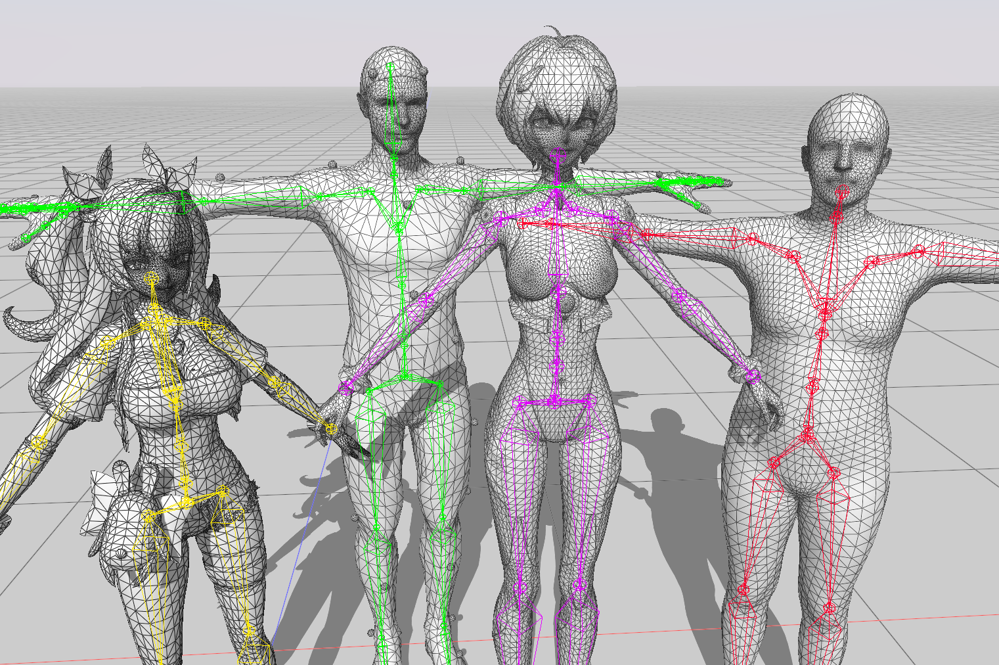

# toolkit library | Document

## [toolkit](./toolkit/README.md)

Minimal game engine based on entt and OpenGL 4.6. Designed to be simple with reliable graphics and file io. Refacted from my former projects [GraphicsToolkit](https://github.com/lovoski/GraphicsToolkit) and [Engine](https://github.com/lovoski/Engine).

## [Manga Viewer](./manga_viewer/README.md)

可以读入 **.pdf**,**.epub** 格式电子书的阅读器，利用了 `toolkit` 封装的 opengl 命令，通过 compute shader 实现了仿真翻页功能，对于文件的读入采用了 `mupdf` 库。
