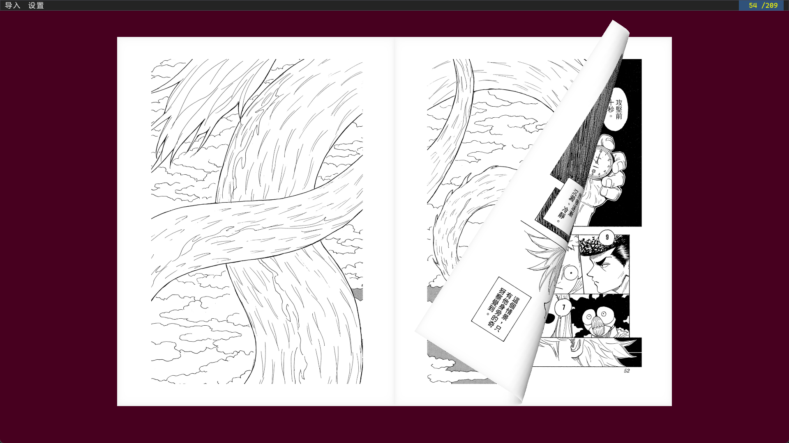
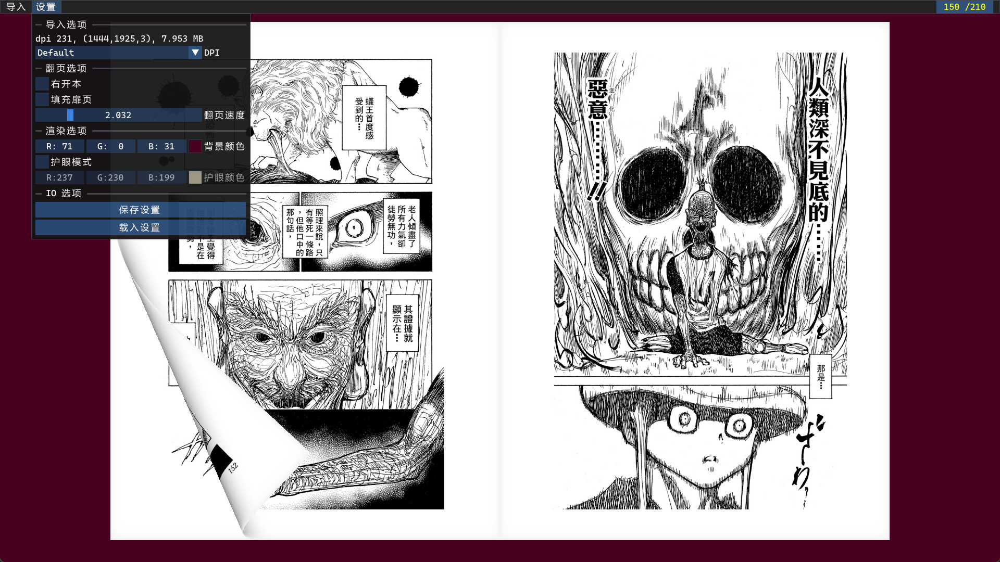

# 漫画阅读器说明

这是一个可以导入 **.pdf,.epub** 格式电子书（主要是扫描的漫画）的本地阅读器。对于保存为图片序列的漫画，可以用提供的 `pdf_utils.py` 脚本将这个文件夹下所有的图片转化为一个与文件夹名称相同的 **.pdf** 文件。[这里有一份在 windows 下编译的可执行程序。](https://drive.google.com/file/d/1tm1j0MPuAlcLx4bn7uTGm714VXiYWKRw/view?usp=sharing)

我编写这个软件的初衷是，我并没有找到一个配置简单，容易获取，符合我阅读习惯的漫画阅读器。我想要类似苹果图书和微信读书的仿真翻页动画，而且需要同时显示两页（漫画中会有大跨页），希望能够同时照顾到左开本和右开本的图书，也想要一个选项在大跨页没对齐的时候能手动填充扉页让大跨页的两张纸在同一个版面。上面提到的这些功能在这个阅读器均有实现。

## 操作说明

软件只支持键鼠操作，手柄触屏均不支持。

通过键盘上的<kbd>←</kbd>和<kbd>→</kbd>按键可以翻页。鼠标中键按住拖动可以调整图书的位置，鼠标滚轮调整图书的大小，<kbd>R</kbd> 键重置图书位置和大小。打开大写锁定之后，可以用鼠标左右键分别向左向右翻页。

## 界面说明

渲染和动画是用 OpenGL 4.6 自己搭建的，文件的解析采用 mupdf 库，界面看起来会比较简陋，但是基本上符合了我的需求：

左上角的“导入”可以打开一个文件选择对话框导入电子书，对于 **.pdf** 电子书可以立刻载入，**.epub** 格式的电子书需要等待 1-2 秒的解析时间。

“设置”则是会打开一个选项页面，可以调整阅读器的参数：

其中 DPI 决定了导入页面的清晰度，不过扫描的漫画每一个页面都是分辨率固定的图片，过高的 DPI 只会导致每次从 CPU 传输到 GPU 的 texture 过大，保持这个选项在 “Default” 位置会限制每页占用的内存大小不超过 8 MB。

“右开本”则是决定软件是否将当前图书当作右开本排版。举例来说，对于右开本图书（绝大部分大陆出版的图书），如果左边的书页页码是 8，右边的页码就是 9。但是对于左开本图书（绝大部分日漫和日轻），右边的页码是 7 而不是 9。对于小说这其实不是问题，但是漫画的大跨页会无法对齐。

“填充扉页”会在图书的第一页后面填充一个空白页，如果电子书的制作者没有考虑到大跨页的对齐问题，可以用这个手动对齐。

其余的设置非常易懂，调整设置到自己喜欢的参数后，可以用“保存设置”按钮将这些参数保存到相对二进制文件的 `preference.json` 文件里面，下次打开文件可以沿用设置，如果有需求，也可以手动改这个设置文件，参数名都比较可读。

## 编译说明

编译起来比较麻烦，首先要把 mupdf 的 github 项目拉到本地，确保所有的 submodules 都到位之后编译成可链接的二进制文件。之后修改 `CMakeLists.txt` 里面的路径，再尝试编译整个项目。
