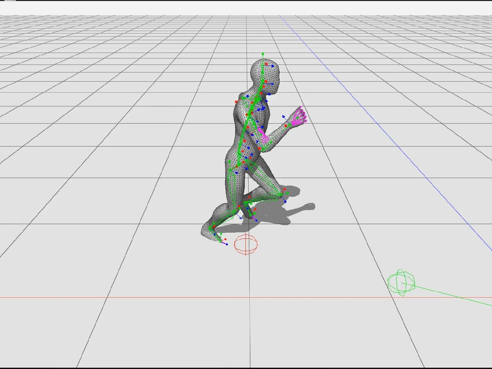

# Document

## Important

工具包本身完全采用 c++20 编写，在 msvc 和 gcc 上通过了编译，支持 window，linux 平台。

类似 unreal engine，工具包中使用右手坐标系（正 Y 为上方向，正 Z 为前方向）；内部长度单位默认为1m；渲染时摄像机朝向负 Z 方向，遵循 opengl 的规范；采用 32 位浮点数；数学库直接采用 Eigen。

`toolkit` 可以直接复制到别的项目中，通过以下 cmake 命令链接使用：

```cmake
add_subdirectory(toolkit)
...
target_link_libraries(main PRIVATE toolkit)
```

## 支持文件格式

我编写这个项目的目标不是实现一个界面、功能完善的游戏引擎取代工作中 unity，unreal 的位置，而是提供一个我自己足够熟悉的平台，快速实践一些想法，或者快速可视化一些 python 处理后的数据。

为此，这个工具包必须对多种输入文件提供支持，目前支持下面的文件：

1. `.npy,.npz`: 借助 cnpy 实现
2. `.fbx,.obj`: 借助 ufbx 实现，支持 skinned mesh 和 blend shape
3. `.bvh`: 自主实现
4. `.png,.jpg,.bmp`: 借助 stb_image 实现
5. `.json`: 借助 nlohmann json 实现

除了上面这些常用的中间结果，还有下面这些格式：

5. `.scene`: 自定义场景文件，json 格式
6. `.bundle`: 自定义 bundle 文件，json 格式

这里对场景文件和 bundle 文件做出说明。场景指的是包含了一个场景中所有的实体，组件，系统参数的文件，本身就是完整的。bundle 文件保存了一个场景中一部分实体，组件的状态，并不是完整的场景中，但是可以快速融合到现有的场景中，可以用来保存一些角色，场景。

## script 的说明

script 的概念非常类似 unity 中的 c# script。在使用方式上两者基本保持一致，不过本引擎中的 script 其实是引擎源代码的一部分，需要直接编译到引擎中发生效果，也不支持热更新。请参考以下例子或者引擎中的其他例子编写 script。

```c++
#pragma once

#include "toolkit/opengl/editor.hpp"
#include "toolkit/scriptable.hpp"
#include "toolkit/system.hpp"

class test_script : public toolkit::scriptable {
public:
  void start() override {
    // initialize member variables here
    // use the member variables "registry" and "entity" if needed.
  }
  void destroy() override {
    // destroy member variables if neccessary
  }
  void update(toolkit::iapp *app, float dt) override {
    // single thread main loop update
  }
  void fixedupdate(toolkit::iapp *app, float dt) override {
    // single thread main loop update with fixed interval
    // you can modify the interval with inherited member variable "fixed_interval"
  }
  void draw_to_scene(toolkit::iapp *app) override {
    toolkit::opengl::script_draw_to_scene_proxy(app, 
      [&](toolkit::opengl::editor *editor, 
          toolkit::transform &cam_trans,
          toolkit::opengl::camera &cam_comp) {
        // dispatch draw calls from "toolkit/opengl/draw.hpp"
        // or write your own debug draw functions.
        // draw calls here will be rendered on top of the main scene.
    });
  }

  void draw_gui(toolkit::iapp *app) override {
    // use ImGui here to provide gui support to modify member variables
  }
};
// The first parameter to "DECLARE_SCRIPT" is the name for your custom script
// The second parameter is the category of your own script, this makes it possible
// to add an instance of this script with editor gui automatically.
DECLARE_SCRIPT(test_script, utils)
```

## system 的说明

系统通过继承， entt 以及自定义的宏实现，所有的 script 继承自 scriptable，scriptable 继承自 icomponent，都可以通过 entt 的接口管理：

```c++
auto &comp = registry.get<some_component_class>(some_entity);
auto &script = registry.get<some_script_class>(some_entity);
```

script 的功能借助 `toolkit/toolkit/opengl/rasterize/defered.cpp` 和 `toolkit/toolkit/scriptable.hpp` 中的两个 system 实现，前者实现了 `draw_to_scene`，后者维护其余的逻辑。

渲染系统（`toolkit/toolkit/opengl/rasterize/defered.cpp`）采用延迟渲染，实现了 blendshape，LBS skinned mesh，高质量角色阴影等展示常用的效果。

[](https://www.bilibili.com/video/BV1eVHazJEvf/?spm_id_from=333.1007.top_right_bar_window_history.content.click&vd_source=bcaf713b6b1c92e7d54cf304c76ff4d2)